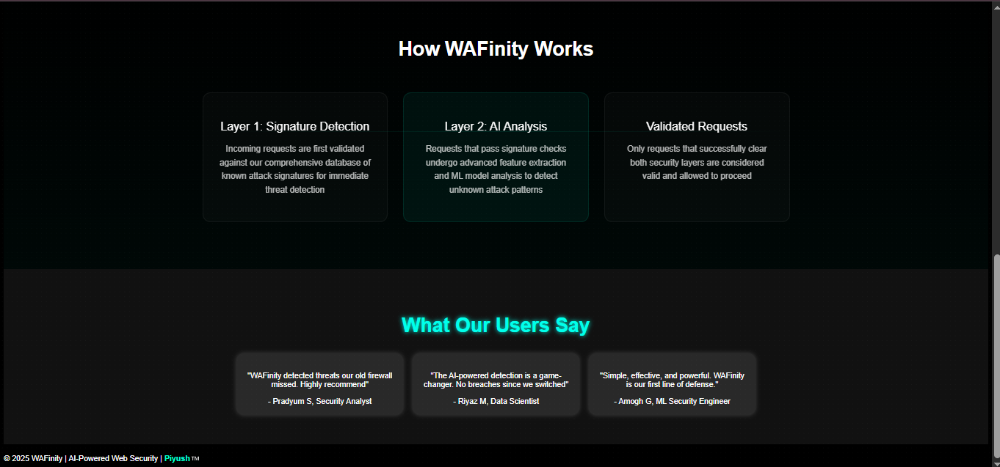
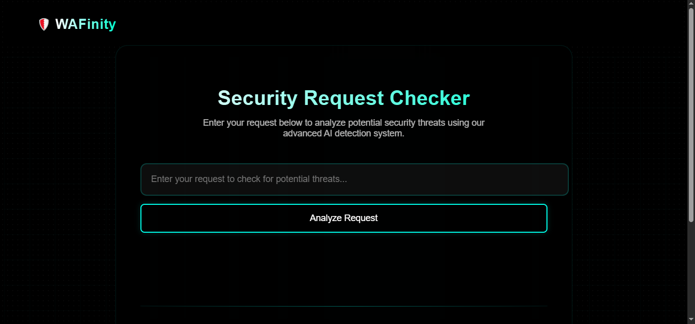
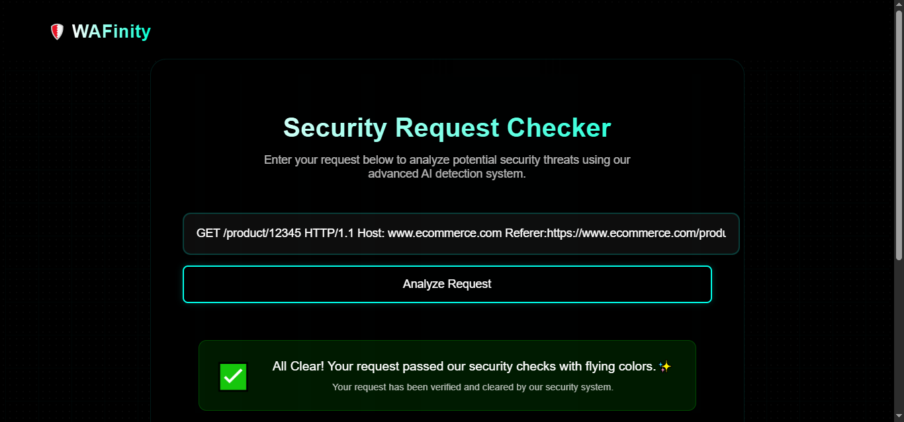
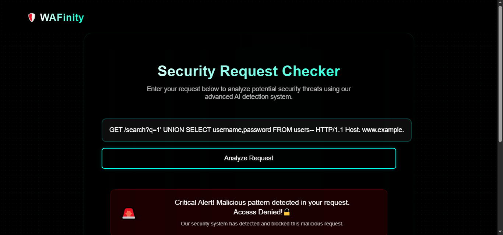

# WAFinity - Infinite Protection, Intelligent Detection

**WAFinity** is an Advanced Web Application Firewall (WAF) that protects web applications from known threats such as SQL injection, Cross-Site Scripting (XSS), and other similar attacks by filtering and monitoring HTTP traffic between the application and the Internet.

In addition to signature-based detection, it uses **machine learning-based anomaly detection** to identify obfuscated, zero-day, and previously unknown attacks by analyzing patterns and behaviors in incoming requests.

## **How it works**


## Features

- 🚫 Block Known Web Attacks
- 🤖 AI-powered threat detection
- 🛡️ Real-time Request Analysis
- ✨ Modern, Responsive UI
- 📊 Interactive Security Insights
- 🚀 Fast response time


##  Output Screenshots

<p float="left">
    
    
</p>

<p float="left">
    
    
</p>

<p float="left">
    
    
</p>


## Tech Stack

- Python/Flask
- JavaScript
- HTML/CSS
- Machine Learning

## 🧪 Example Requests
### ✅ Valid Requests

**1. Homepage**
```
GET / HTTP/1.1
Host: www.example.com
```

**2. Product listing**
```
GET /products?category=electronics&page=2 HTTP/1.1
Host: www.ecommerce.com
Referer: https://www.ecommerce.com/products
```

**3. Single product**
```
GET /product/12345 HTTP/1.1
Host: www.ecommerce.com
Referer:https://www.ecommerce.com/products?category=electronics&page=2
```

**4. Add to cart (POST with JSON body)**
```
POST /cart/add HTTP/1.1
Host: www.ecommerce.com
Content-Type: application/json
Content-Length: 45

{"productId": "12345", "quantity": 1}
```

### ❌Signature-Based Detection (Malicious Input)

**1. SQL Injection via search**
```
GET /search?q=' OR '1'='1'; DROP TABLE users;-- HTTP/1.1
Host: www.example.com
```

**2. XSS in comment**
```
GET /comment?text=<script>alert('XSS')</script> HTTP/1.1
Host: www.example.com
```

**3. XSS using eval**
```
GET /comment?text=<script>eval(String.fromCharCode(97,108,101,114,116,40,39,88,83,83,39,41))</script> HTTP/1.1
Host: www.example.com
```

**4. SQL Injection with UNION**
```
GET /search?q=1' UNION SELECT username,password FROM users-- HTTP/1.1
Host: www.example.com
```

### 🚨  ML-based Anomaly Detection (Obfuscated Malicious Input/Encoded Attacks)

**1. URL-encoded SQLi**
```
GET /search?q=%27%20OR%20%271%27%3D%271 HTTP/1.1
Host: www.example.com
```

**2. Hex-encoded SQLi**
```
GET /search?q=\x27\x20OR\x20\x31\x3D\x31 HTTP/1.1
Host: www.example.com
```

**3. Obscure HTML Elements + JS Access**
```
GET /comment?text=<details%20open%20ontoggle=Function('ale'+'rt(1)')()> HTTP/1.1
```

**4. Encoded XSS**
```
GET /comment?text=%3Cscript%3Ealert%28%27XSS%27%29%3C%2Fscript%3E HTTP/1.1
Host: www.example.com
```

## 🛠️Setup

1. Clone the repository:

bash
```
git clone https://github.com/YOUR_USERNAME/Advanced-WAF-WAFinity.git
```
```
cd Advanced-WAF-WAFinity
```

2. Install dependencies:

bash
```
pip install -r requirements.txt
```

3. Run the application:

bash
```
python app.py
```

## License

MIT License
" > README.md

## Add and commit README
git add README.md
git commit -m "Add README.md"
git push
